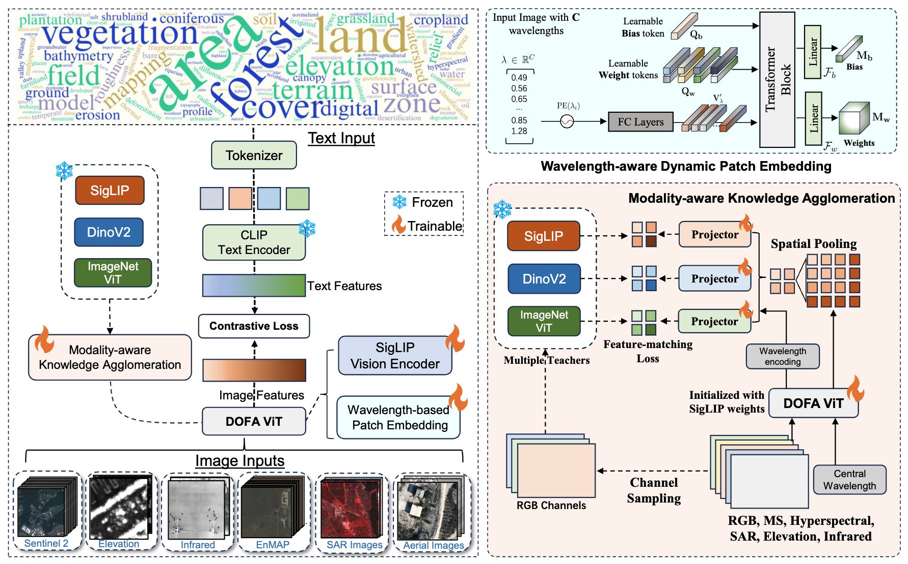
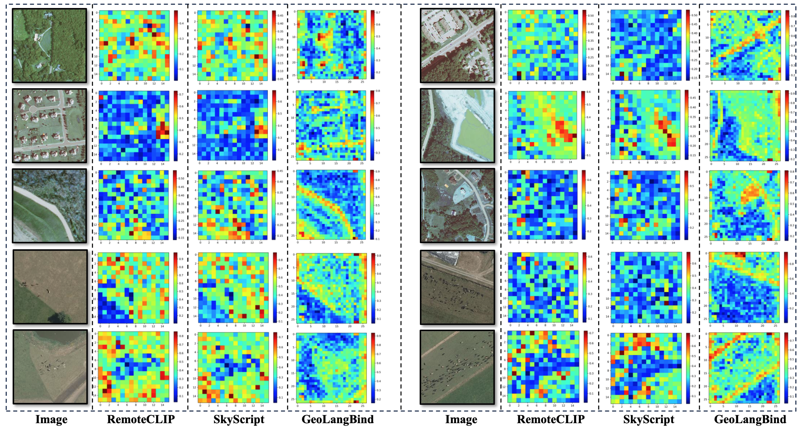
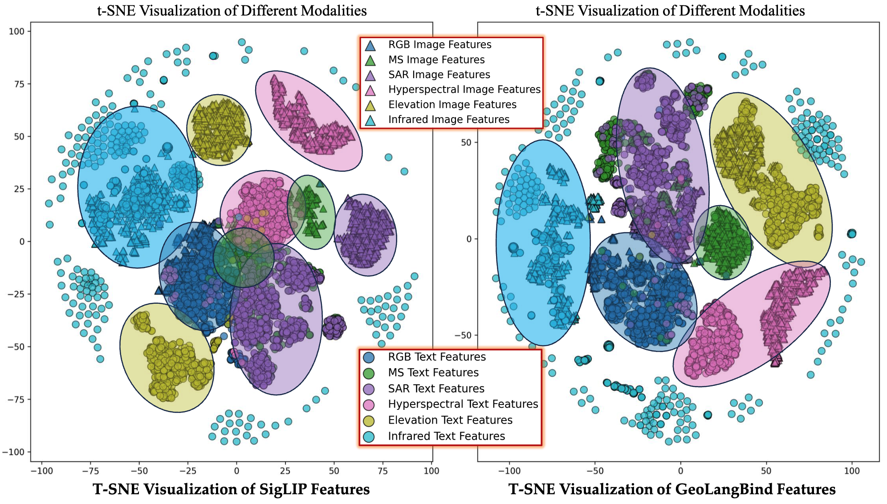
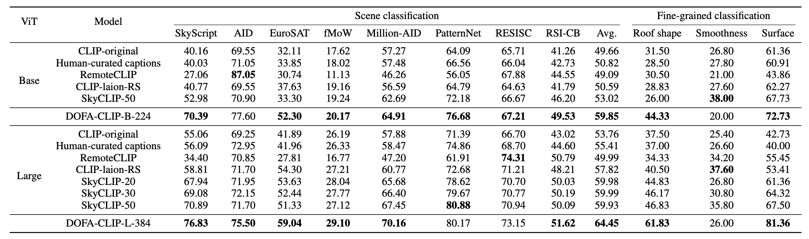

# DOFA-CLIP: Dynamic-One-For-All CLIP for Earth Observation

[](https://arxiv.org/abs/2503.06312)
[](https://huggingface.co/earthflow/GeoLB-ViT-14-SigLIP-so400m-384-EO)
[](LICENSE)

*We rename GeoLangBind to DOFA-CLIP for easier recognition and alignment with CLIP-style vision-language models.*

## News
- GeoLangBind renamed to DOFA-CLIP.
- Online demo is coming soon.

## Abstract

Earth observation (EO) spans a broad spectrum of modalities, including optical, radar, multispectral, and hyperspectral data, each capturing distinct environmental signals. However, current vision-language models in EO, particularly CLIP-based variants, remain confined to individual modalities, limiting generalization and scalability across diverse tasks. We present **DOFA-CLIP (Dynamic-One-For-All CLIP)**, a unified vision-language foundation model that dynamically adapts to EO modalities with flexible channel configurations through a single Transformer backbone.

Our approach introduces three key contributions:
1. **GeoLangBind-2M**: A large-scale EO image–text dataset covering six heterogeneous modalities with rich natural language descriptions
2. **VECT (Vision-models Enhanced Contrastive Text-image pretraining)**: A novel training strategy that enhances CLIP training with representations from multiple vision foundation models
3. **MaKA (Modality-aware Knowledge Agglomeration)**: A module that refines feature distillation with modality-specific awareness

DOFA-CLIP achieves state-of-the-art zero-shot performance across a wide range of EO benchmarks, including unseen modalities and variable input channels. Together, these contributions establish a scalable foundation for multimodal EO understanding and open new avenues for integrating heterogeneous EO data with large language models.

## Method Overview

### Architecture

DOFA-CLIP employs a unified vision-language architecture that dynamically adapts to different Earth observation modalities through wavelength-aware processing:


*Figure 1: Overview of DOFA-CLIP architecture showing the dynamic adaptation mechanism for different EO modalities.*

### Feature Visualization

Our method demonstrates superior spatial awareness and clear spatial patterns compared to baseline approaches:


*Figure 2: Feature visualization comparison showing DOFA-CLIP's enhanced spatial awareness and pattern recognition capabilities.*

### T-SNE Analysis

T-SNE visualization reveals how DOFA-CLIP effectively separates different visual modalities and aligns them with corresponding text features:


*Figure 3: T-SNE visualization of DOFA-CLIP features across different visual modalities and text representations.*

## Installation

### Prerequisites
- Python 3.8+
- PyTorch 1.12+
- CUDA (for GPU support)

### Setup

1. Clone the repository and navigate to the DOFA-CLIP directory:
```bash
git clone <your-repo-url>
cd tecula/backend/builtin_models/DOFA-CLIP
```

2. Install the required dependencies:
```bash
pip install torch torchvision torchaudio
pip install Pillow
```

3. Install open_clip (required for DOFA-CLIP):
```bash
git clone https://github.com/mlfoundations/open_clip.git
cd open_clip
pip install -e .
cd ..
```

## Usage

### Basic Example

Here's a simple example of how to use DOFA-CLIP for zero-shot image classification:

```python
import torch
import torch.nn.functional as F
from PIL import Image
from open_clip import create_model_from_pretrained, get_tokenizer

# Load the pre-trained DOFA-CLIP model
hf_repo = "hf-hub:earthflow/GeoLB-ViT-14-SigLIP-so400m-384-EO"
model, preprocess = create_model_from_pretrained(hf_repo)
tokenizer = get_tokenizer(hf_repo)

# Move model to GPU if available
device = "cuda" if torch.cuda.is_available() else "cpu"
model = model.to(device)

# Load and preprocess your image
image = Image.open("your_image.png")
image = preprocess(image).unsqueeze(0).to(device)

# Define your text labels
labels_list = [
    "A busy airport with many aeroplanes.",
    "Satellite view of Hohai university.", 
    "Satellite view of sydney",
    "Many people in a stadium"
]

# Tokenize text
text = tokenizer(labels_list, context_length=model.context_length)
text = text.to(device)

# Perform inference
with torch.no_grad(), torch.cuda.amp.autocast():
    # Define wavelengths for your specific modality
    # These are example wavelengths for RGB bands
    wvs = torch.tensor([0.665, 0.560, 0.490]).to(device)
    
    # Encode image and text
    image_features = model.visual.trunk(image, wvs)
    text_features = model.encode_text(text)
    
    # Normalize features
    image_features = F.normalize(image_features, dim=-1)
    text_features = F.normalize(text_features, dim=-1)
    
    # Calculate probabilities
    text_probs = torch.sigmoid(
        image_features @ text_features.T * model.logit_scale.exp() + model.logit_bias
    )

# Display results
zipped_list = list(zip(labels_list, [round(p.item(), 3) for p in text_probs[0]]))
print("Label probabilities:", zipped_list)
```

### Key Features

- **Multi-modal Support**: Works with optical, radar, multispectral, and hyperspectral data
- **Dynamic Channel Configuration**: Adapts to variable input channels through wavelength specification
- **Zero-shot Classification**: Performs classification without task-specific training
- **Flexible Text Descriptions**: Supports natural language descriptions for various EO tasks

### Wavelength Configuration

DOFA-CLIP uses wavelength information to adapt to different modalities. Here are some common configurations:

```python
# RGB (visible light)
wvs_rgb = torch.tensor([0.665, 0.560, 0.490])  # Red, Green, Blue

# Sentinel-2
wvs_multi = torch.tensor([0.665, 0.56, 0.49, 0.705, 0.74, 0.783, 0.842, 1.61, 2.19])  # 9 bands

```

### Custom Image Encoding Function

For more control over the encoding process:

```python
def encode_image(model, image, wvs, normalize: bool = False):
    """Encode image with specified wavelengths.
    
    Args:
        model: DOFA-CLIP model
        image: Preprocessed image tensor
        wvs: Wavelength tensor
        normalize: Whether to normalize features
    
    Returns:
        Image features
    """
    features = model.visual.trunk(image, wvs)
    return F.normalize(features, dim=-1) if normalize else features
```

## Experimental Results

### Zero-Shot Classification Performance

DOFA-CLIP demonstrates state-of-the-art performance across multiple zero-shot classification benchmarks:


*Table 1: Zero-shot classification results on various Earth observation datasets, showing DOFA-CLIP's superior performance across different modalities.*

## Model Details

- **Architecture**: Vision Transformer (ViT-14) with SigLIP
- **Training Data**: GeoLangBind-2M dataset
- **Supported Modalities**: 6 heterogeneous EO modalities
- **Input Resolution**: 384×384

## Citation

If you use DOFA-CLIP in your research, please cite our paper.

## License

This project is licensed under the MIT License - see the [LICENSE](LICENSE) file for details.

## Acknowledgments

- Built on top of [OpenCLIP](https://github.com/mlfoundations/open_clip)
- Inspired by the original SigLIP architecture
- Thanks to the Earth observation community for valuable feedback
